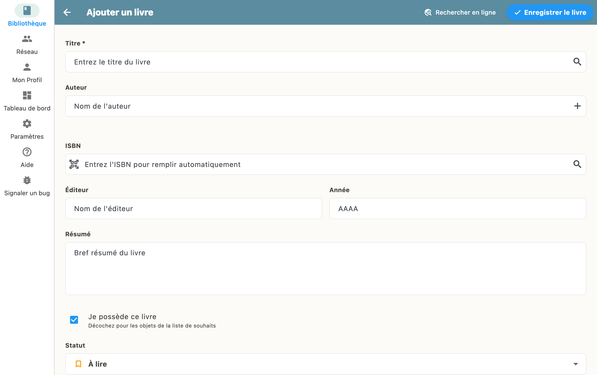

Gehen Sie zu "Meine Bibliothek" und tippen Sie auf die Schaltfläche "+". Sie können einen Barcode scannen oder nach Titel oder ISBN suchen.

## Einen Barcode scannen

Öffnen Sie die App, tippen Sie unten rechts auf "+" und wählen Sie "Scannen".

Richten Sie die Kamera auf den Barcode des Buches. BiblioGenius erkennt ihn automatisch und holt alle Metadaten: Titel, Autor, Cover und mehr.

## Nach Titel oder ISBN suchen

Sie können ein Buch auch über seinen Titel oder seine ISBN suchen:

1. Tippen Sie auf "+" und dann auf "Suchen"
2. Geben Sie Titel, Autor oder ISBN ein
3. Wählen Sie den richtigen Treffer aus der Liste
4. Das Buch wird mit allen Angaben übernommen

## Manuelle Eingabe

Wenn das Buch in den Katalogen nicht zu finden ist, legen Sie es von Hand an und füllen Titel, Autor und die weiteren Felder aus.

