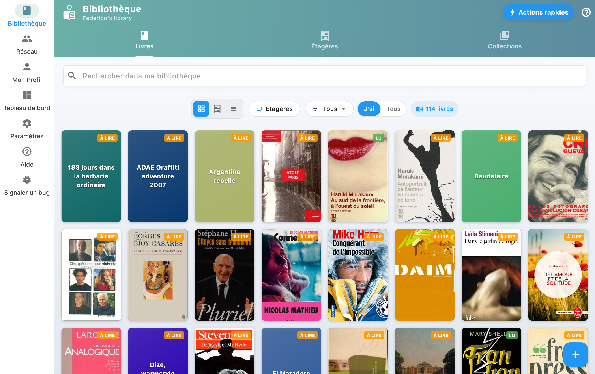
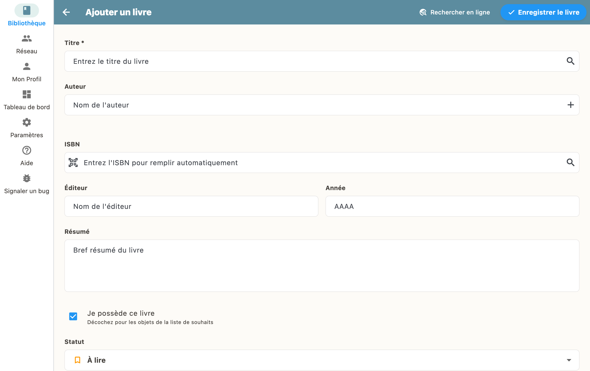

Allez dans "Ma Bibliothèque" et appuyez sur "+". Vous pouvez scanner un code-barres ou chercher par titre/ISBN.

## Scanner un code-barres

Ouvrez l'app et appuyez sur le bouton "+" en bas à droite, puis choisissez "Scanner".

Pointez votre caméra vers le code-barres du livre. BiblioGenius le reconnaît automatiquement et récupère toutes les métadonnées (titre, auteur, couverture, etc.).

## Rechercher par titre ou ISBN

Vous pouvez aussi chercher un livre par son titre ou son numéro ISBN :

1. Appuyez sur "+" puis "Rechercher"
2. Saisissez le titre, l'auteur ou l'ISBN
3. Sélectionnez le bon résultat dans la liste
4. Le livre est ajouté avec toutes ses informations

## Saisie manuelle

Si le livre n'est pas trouvé dans les catalogues, vous pouvez le créer manuellement en remplissant les champs titre, auteur, et autres informations.

