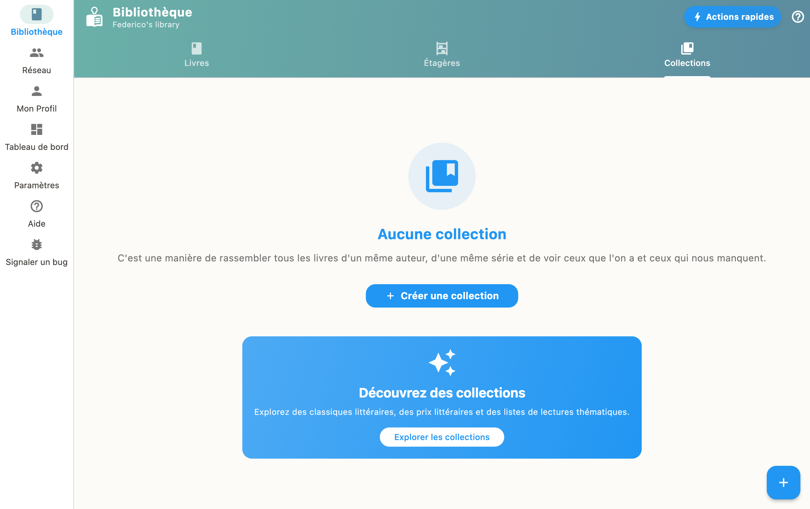

Collections group your books into custom lists: a saga, a theme, a reading challenge, a list to hand to someone. You create them from the Collections tab, and fill them with your own books or with an imported list.

## Create a collection

1. Go to the "Collections" tab
2. Tap "+" to create a new collection
3. Give it a name and a description
4. Add books from your library

## Favorites

On a book page, the star bookmark files it among your favorites. There is nothing else to do: the **"Favorites"** collection exists on its own, and the star is its only door. Marking a book adds it, unmarking takes it out.

A favorite book weighs double in your [reading suggestions](recommendations.html): it is the most direct signal you can give the app about your taste.

If you were already keeping such a collection by hand, BiblioGenius offers once to adopt it as your Favorites collection. Its books then become favorites. You can decline, and the question does not come back.

Everything stays on your device, like the rest of your collections.

## Series-typed collections

A collection can be marked as a **series**. Its volumes then appear in order, and the app can point at the one that is missing. See [Following a series](series.html).

## Sharing a list

From a collection, the **"Share"** action opens a summary of what you are about to send: the list name, how many books it holds, and the declared languages. Two ways to pass it on:

- **Copy** puts the list on the clipboard, in a form the import can read back;
- **Send the file** produces a `.bibliogenius.yml` file you hand over however you like.

The file carries your library name as the contributor, so that your correspondent can tell your list apart from another one with the same name.

Nothing enters your correspondent's library before they confirm.

## Receiving a list

The **"Import"** action, in the Collections tab, accepts three forms:

- a `.bibliogenius.yml` file, as sent by "Share";
- a `.yaml` or `.yml` file;
- a list pasted from the clipboard.

The import first shows what it understood: the title, the description, the book count and the sender's name. You then decide which status to give the books, as for a [ready-made selection](curated-lists.html). A very long list is flagged before it starts, because the import queries a metadata source for every book.

A received list is a list like any other: it overwrites nothing, changes none of your existing books, and cannot trigger anything on its own.

## Selections for your library

Under your collections, a **"Selections for your library"** block offers ready-made lists that overlap what you already own, with the reason in plain words: "7 books in common". See [Ready-made selections](curated-lists.html).

## Ways to use them

- Group the volumes of a saga
- Build a themed reading list
- Run a reading challenge
- Send someone a selection of recommended books
