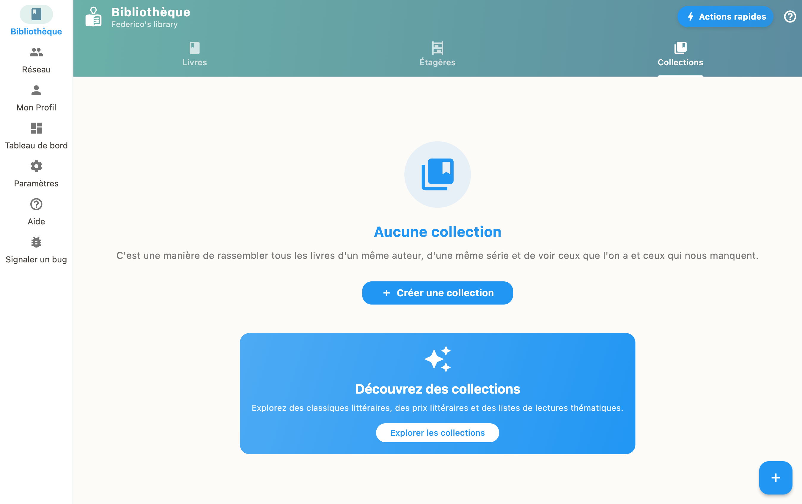

Les Collections vous permettent de regrouper des livres en listes personnalisées (sagas, thèmes, listes de lecture). Créez une collection depuis l'onglet Collections, puis ajoutez des livres de votre bibliothèque ou importez des listes existantes.

## Créer une collection

1. Allez dans l'onglet "Collections"
2. Appuyez sur "+" pour créer une nouvelle collection
3. Donnez-lui un nom et une description
4. Ajoutez des livres depuis votre bibliothèque

## Exemples d'utilisation

- Regrouper les tomes d'une saga
- Créer une liste de lecture thématique
- Organiser un défi lecture
- Partager une sélection de livres recommandés
