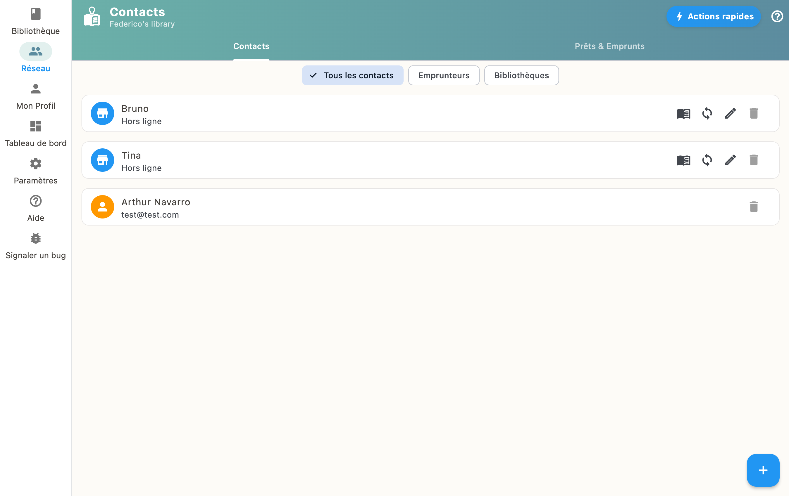

Allez dans "Réseau" pour ajouter des amis ou bibliothèques. Vous pouvez ajouter des emprunteurs (qui peuvent emprunter vos livres) ou des bibliothèques (dont vous pouvez consulter le catalogue).

## Types de contacts

- **Emprunteurs** : des personnes à qui vous prêtez des livres
- **Bibliothèques** : des catalogues que vous consultez et auxquels vous pouvez demander des emprunts

## Ajouter un contact

Vous pouvez ajouter un contact en scannant son QR code ou en saisissant manuellement ses informations.
