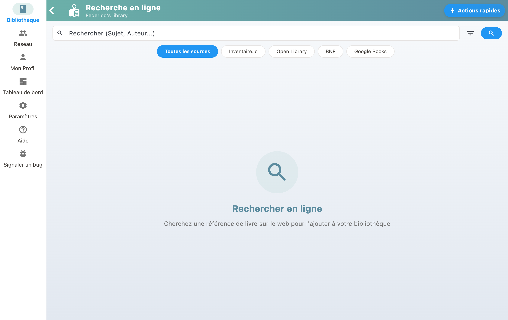

Utilisez l'icône de recherche pour trouver des livres dans les catalogues externes comme la BNF, OpenLibrary et Inventaire. Quand vous trouvez un livre, appuyez dessus pour l'ajouter à votre bibliothèque avec toutes ses métadonnées.

## Sources disponibles

BiblioGenius interroge plusieurs catalogues :

- **BNF** (Bibliothèque nationale de France) : catalogue de référence pour les livres en français
- **OpenLibrary** : catalogue ouvert et collaboratif
- **Inventaire** : base de données basée sur Wikidata
- **Google Books** : source optionnelle (activable dans le profil)

## Filtrer par source

Vous pouvez choisir quelles sources interroger dans les paramètres de recherche, pour obtenir des résultats plus précis.
