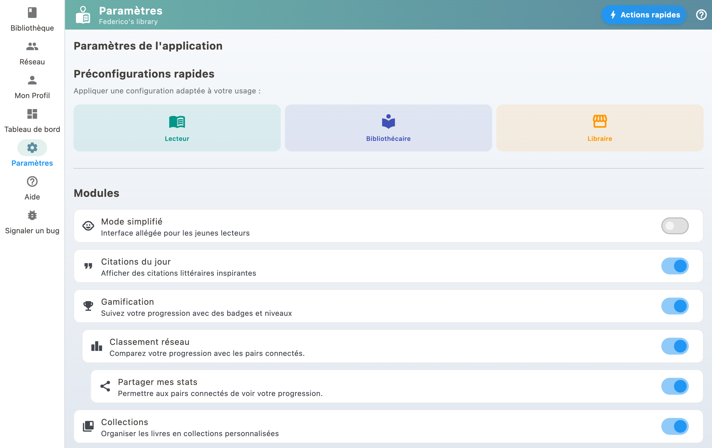

You can import books from Gleeph, Goodreads, Babelio, or any CSV file. This allows you to centralize your library in BiblioGenius.

## Supported import sources

- **Gleeph**: export your books from the Gleeph app
- **Goodreads**: use the Goodreads CSV export
- **Babelio**: export your Babelio library
- **CSV or XLSX file**: any file with title/author/ISBN columns

## How to import

1. Go to Settings
2. Select "Import & organize my library"
3. Choose "File import (CSV / XLSX)"
4. Follow the instructions to import your file

BiblioGenius automatically enriches imported books with metadata from external catalogs (cover, description, etc.).

## If no ISBN column is recognised

The ISBN is what later brings back covers, summaries and editions. When no column in the file carries a name it recognises, BiblioGenius stops and shows you the headers it read. You can then **point at the column** holding the ISBN yourself, or choose to import without one, knowingly.

If your books already came in without ISBNs during an earlier import, they are not lost: hand the same file back from the "Complete my library" screen, which finds each book and gives its ISBN back without creating a duplicate. See [Bulk-updating my books' data](complete-library.html).

For the reverse operation, taking your books out of BiblioGenius, see [Exporting and backing up](export-backup.html).
