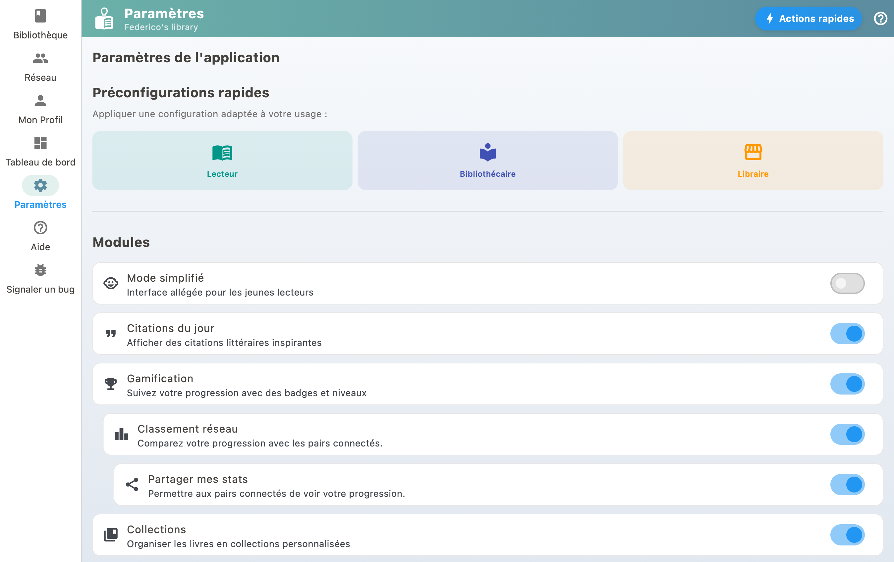

Vous pouvez importer des livres depuis Gleeph, Goodreads, Babelio ou n'importe quel fichier CSV. Cela vous permet de centraliser votre bibliothèque dans BiblioGenius.

## Sources d'import supportées

- **Gleeph** : exportez vos livres depuis l'app Gleeph
- **Goodreads** : utilisez l'export CSV de Goodreads
- **Babelio** : exportez votre bibliothèque Babelio
- **CSV générique** : tout fichier CSV avec des colonnes titre/auteur/ISBN

## Comment importer

1. Allez dans les Paramètres
2. Sélectionnez "Migration / Import"
3. Choisissez votre source
4. Suivez les instructions pour importer votre fichier

BiblioGenius enrichit automatiquement les livres importés avec les métadonnées des catalogues externes (couverture, description, etc.).
