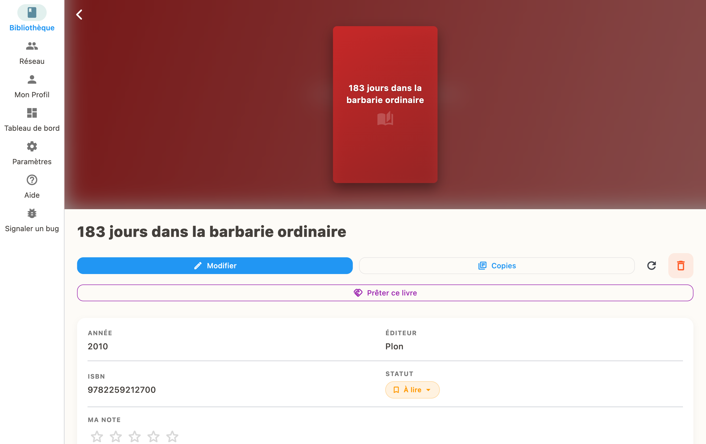
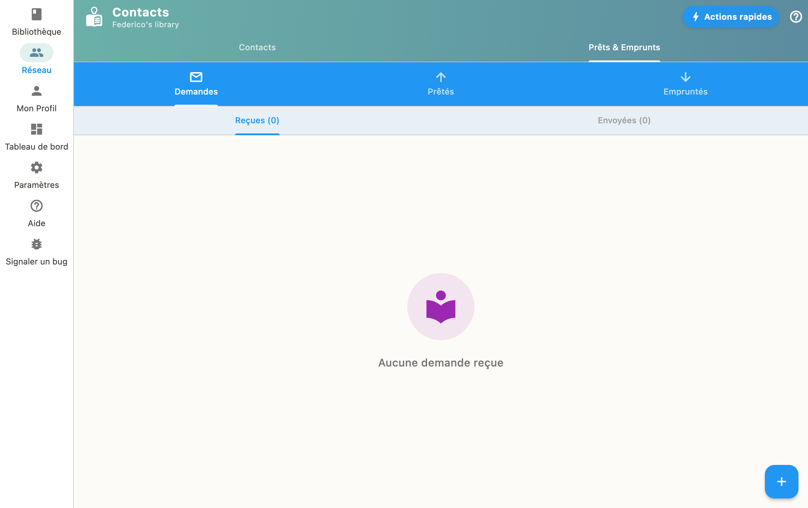

Trouvez le livre, appuyez sur "Gérer les copies", puis "Prêter". Choisissez un contact.

## Étapes pour prêter

1. Allez dans votre bibliothèque et ouvrez la fiche du livre
2. Appuyez sur "Gérer les copies"
3. Sélectionnez "Prêter"
4. Choisissez le contact à qui prêter
5. Confirmez le prêt

## Suivi des prêts

Vos prêts en cours sont visibles depuis la section "Demandes". Vous pouvez marquer un livre comme rendu à tout moment.

