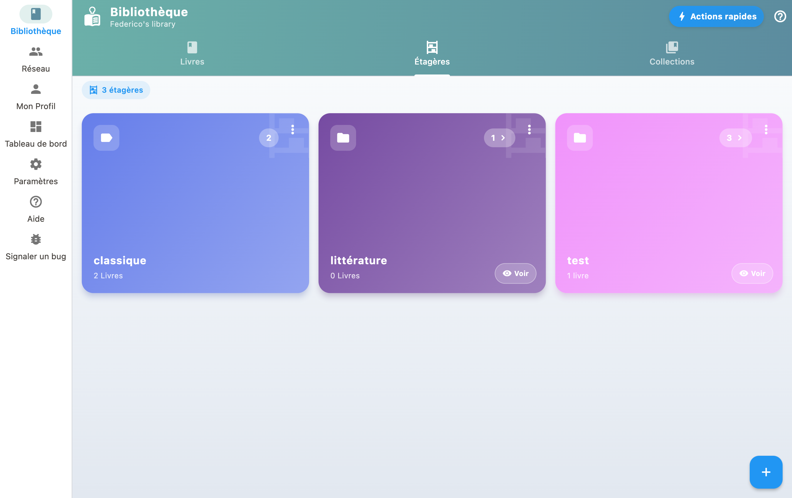

Shelves let you classify your books by theme, genre or any other criteria.

## Create and manage shelves

1. Create thematic shelves for your books (e.g., "SciFi", "Favorites").
2. In your Library, tap a shelf to filter.
3. Tap the Sort icon to enter reorder mode.
4. Drag books to your preferred order, or tap A-Z for auto-sort by author.
5. Tap the checkmark to save your arrangement!

## Assign books to shelves

From a book's detail page, you can assign it to one or more shelves. A single book can appear on multiple shelves.

## Reorder books

Switch to reorder mode to change the order of books by drag-and-drop, or use auto-sort (by author, title, date added).

## A shelf that looks empty

The count shown on a shelf matches what the shelf shows once opened: the two numbers no longer contradict each other.

A shelf whose books all sit outside the default view stays listed, at zero, and opens on an explanation: "Nothing on this shelf is in your library", with how many books are concerned, wishlist books or books on loan, and a **"Show them anyway"** button. See [My wishlist](wishlist.html).

## Suggested genres

When adding or editing a book, BiblioGenius offers a closed list of genres (crime, science fiction, biography, comics and so on), with a second level to refine. Picking a genre files the book on the matching shelf.

It is a shortcut, not an obligation: the shelf is only created when you pick the genre, and your own shelves are never touched. You can ignore the suggestions and keep filing everything by hand.
