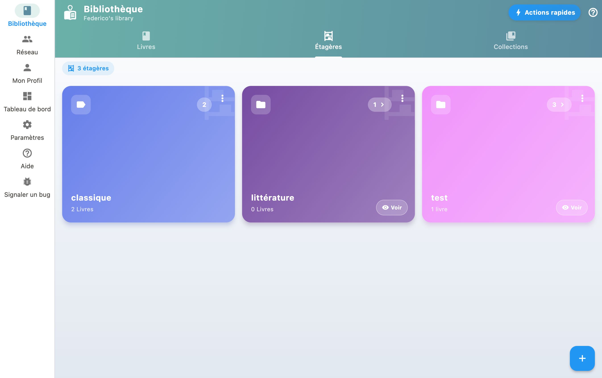

Les etageres vous permettent de classer vos livres par theme, genre ou tout autre critere.

## Creer et gerer des etageres

1. Creez des etageres thematiques pour vos livres (ex : "SF", "Favoris").
2. Dans votre Bibliotheque, appuyez sur une etagere pour filtrer.
3. Appuyez sur l'icone de tri pour entrer en mode reorganisation.
4. Faites glisser les livres dans l'ordre souhaite, ou appuyez sur A-Z pour un tri automatique par auteur.
5. Appuyez sur le bouton de validation pour sauvegarder !

## Attribuer des livres aux etageres

Depuis la fiche d'un livre, vous pouvez l'assigner a une ou plusieurs etageres. Un meme livre peut apparaitre sur plusieurs etageres.

## Reorganiser l'ordre

Passez en mode reorganisation pour changer l'ordre des livres par glisser-deposer, ou utilisez le tri automatique (par auteur, titre, date d'ajout).
