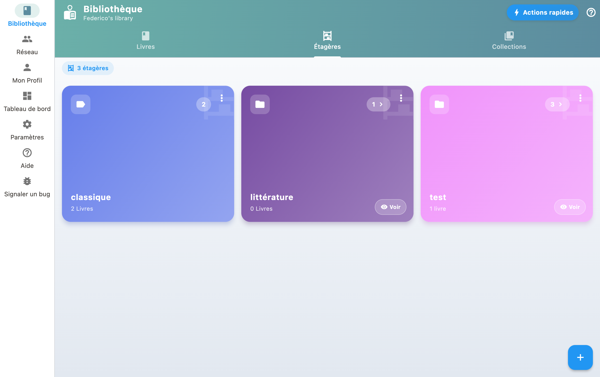

Les étagères vous permettent de classer vos livres par thème, genre ou tout autre critère.

## Créer et gérer des étagères

1. Créez des étagères thématiques pour vos livres (ex : "SF", "Favoris").
2. Dans votre Bibliothèque, appuyez sur une étagère pour filtrer.
3. Appuyez sur l'icône de tri pour entrer en mode réorganisation.
4. Faites glisser les livres dans l'ordre souhaité, ou appuyez sur A-Z pour un tri automatique par auteur.
5. Appuyez sur le bouton de validation pour sauvegarder !

## Attribuer des livres aux étagères

Depuis la fiche d'un livre, vous pouvez l'assigner à une ou plusieurs étagères. Un même livre peut apparaître sur plusieurs étagères.

## Réorganiser l'ordre

Passez en mode réorganisation pour changer l'ordre des livres par glisser-déposer, ou utilisez le tri automatique (par auteur, titre, date d'ajout).
