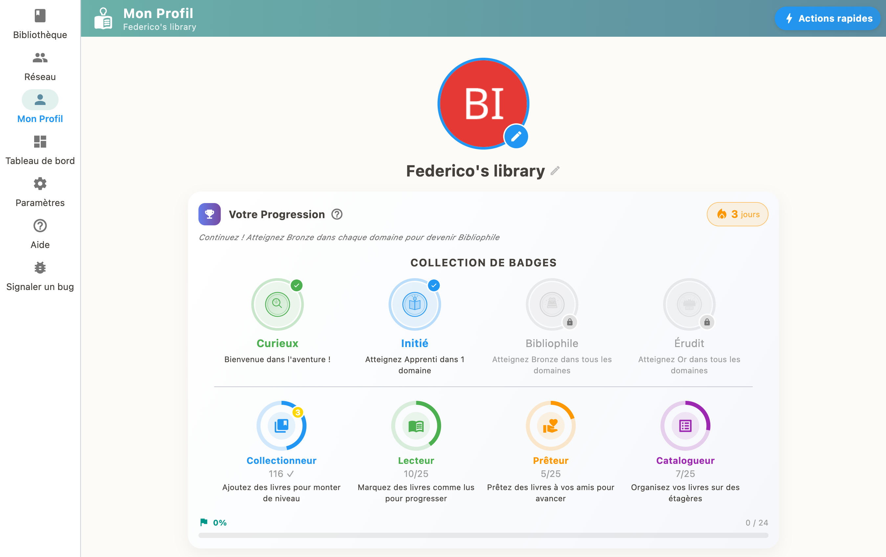

Votre profil regroupe toutes vos statistiques de lecture, vos badges et récompenses, vos objectifs personnels et votre classement entre amis. Accédez-y depuis le menu principal.

## Statistiques de lecture

Retrouvez un résumé de votre activité : nombre de livres lus, pages parcourues, temps de lecture estimé et progression par rapport à vos objectifs.

## Badges et récompenses

Débloquez des badges en atteignant des paliers de lecture. Chaque livre terminé vous rapporte des XP, et vous montez de niveau au fil de vos lectures.

## Objectifs personnels

Définissez un objectif de livres à lire par an. Le profil affiche votre progression en temps réel et vous encourage à atteindre votre cible.

## Classement entre amis

Comparez votre progression avec celle de vos contacts. Le classement est mis à jour automatiquement quand vous êtes connecté avec d'autres bibliothèques.

## Export de sauvegarde

Depuis votre profil, vous pouvez exporter une sauvegarde complète de toutes vos données (livres, étagères, prêts, contacts). Utile en cas de changement d'appareil.
