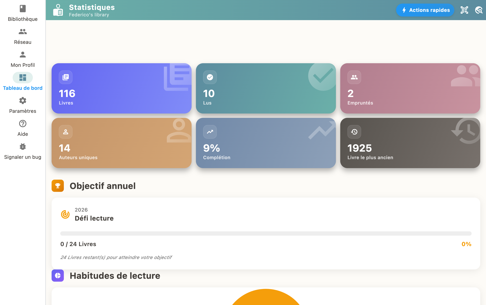

Öffnen Sie ein Buch und tippen Sie auf "Als lesend markieren", um den Fortschritt zu verfolgen. Aktualisieren Sie ihn, während Sie lesen. Am Ende markieren Sie das Buch als "Gelesen", um Erfahrungspunkte zu sammeln und Erfolge freizuschalten.

## Lesestatus

Jedes Buch kann einen Status haben:

- **Zu lesen**: es wartet in Ihrer Leseliste
- **Lesend**: Sie lesen es gerade
- **Gelesen**: fertig
- **Abgebrochen**: Sie haben es beiseitegelegt

## Seitenfortschritt

Solange ein Buch auf "Lesend" steht, können Sie eintragen, auf welcher Seite Sie sind. Der Fortschrittsbalken aktualisiert sich von selbst.

## Belohnungen

Ein zu Ende gelesenes Buch bringt Erfahrungspunkte und kann Erfolge im Gamification-System freischalten.

