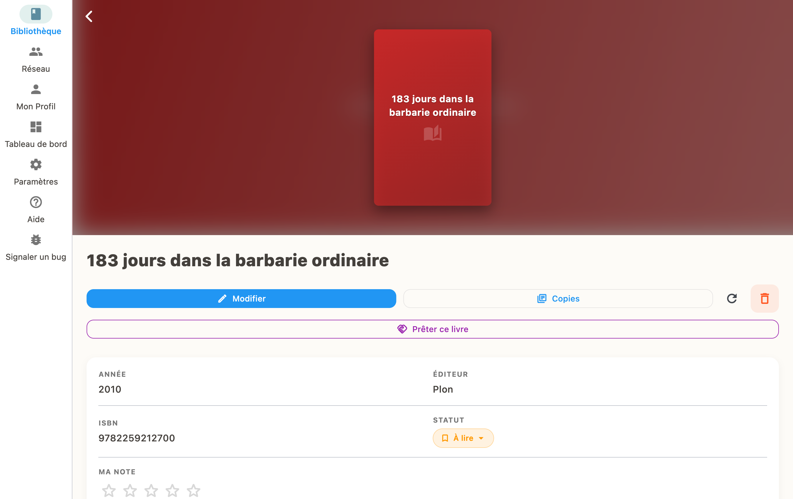
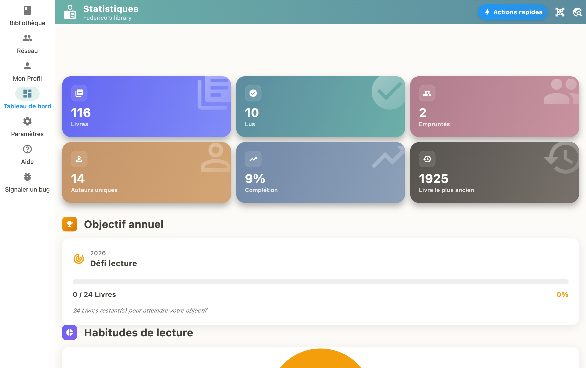

Ouvrez un livre et appuyez sur "Marquer comme En lecture" pour commencer le suivi. Mettez à jour votre progression au fil de votre lecture. Une fois terminé, marquez-le comme "Lu" pour gagner des XP et débloquer des succès !

## Statuts de lecture

Chaque livre peut avoir un statut :

- **À lire** : dans votre liste d'attente
- **En lecture** : vous êtes en train de le lire
- **Lu** : terminé !
- **Abandonné** : vous avez arrêté la lecture

## Progression par pages

Quand un livre est "En lecture", vous pouvez indiquer la page où vous en êtes. La barre de progression se met à jour automatiquement.

## Récompenses

Terminer un livre vous rapporte des XP et peut débloquer des succès dans le système de gamification.

