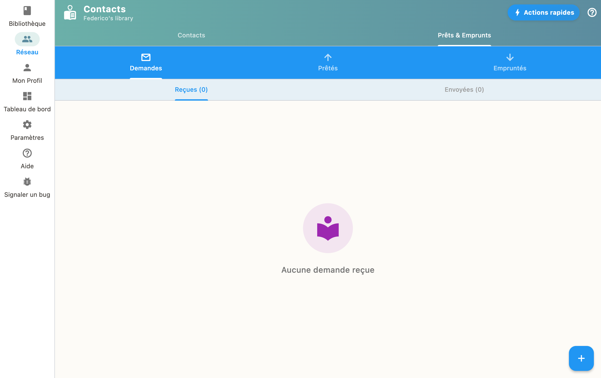

Dans "Demandes", visualisez les demandes recues (personnes souhaitant emprunter vos livres) et envoyees (vos demandes aupres d'autres). Acceptez, refusez ou marquez comme rendu.

## Demandes recues

Quand quelqu'un veut emprunter un de vos livres, vous recevez une demande. Vous pouvez :

- **Accepter** la demande et preter le livre
- **Refuser** la demande

## Demandes envoyees

Suivez l'etat de vos propres demandes d'emprunt aupres d'autres bibliotheques.

## Retours

Quand un livre est rendu, marquez-le comme "Rendu" pour mettre a jour votre bibliotheque.
