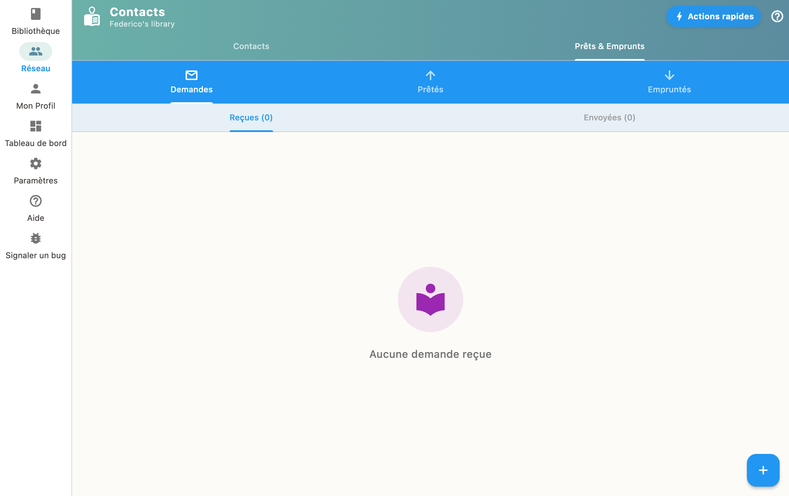

Dans "Demandes", visualisez les demandes reçues (personnes souhaitant emprunter vos livres) et envoyées (vos demandes auprès d'autres). Acceptez, refusez ou marquez comme rendu.

## Demandes reçues

Quand quelqu'un veut emprunter un de vos livres, vous recevez une demande. Vous pouvez :

- **Accepter** la demande et prêter le livre
- **Refuser** la demande

## Demandes envoyées

Suivez l'état de vos propres demandes d'emprunt auprès d'autres bibliothèques.

## Retours

Quand un livre est rendu, marquez-le comme "Rendu" pour mettre à jour votre bibliothèque.
